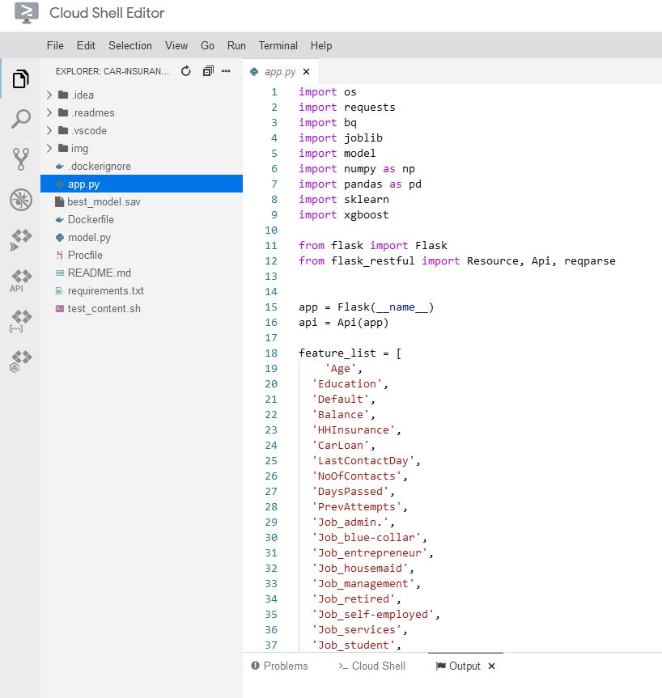

# Car Insurance Prediction

Training and deploying an ML model to predict whether or not an individual is likely to purchase car insurance. 

The data used will be from the following dataset: https://www.kaggle.com/kondla/carinsurance  Note: The file 'carInsurance_train.csv' will be split into train and test sets for modelling and prediction, as the provided 'carInsurance_test.csv' does not have any ground truth labels to validate against.

In the first section of this notebook we will perform EDA,  pre-processing and some feature engineering in order to prepare the data  for modelling. In the modelling segment, we will use Grid Search Cross Validation to  find the optimal parameters to train an XGBoost model, to predict whether a person will purchase car insurance or not.

In the final segment of the notebook, we can make a call to the Flask API serving the persisted trained model via Google Cloud Run, in order to make a prediction on a sample from the test set. To summarise the steps here, a Docker container is created and deployed via Cloud Run, with the code to continuously run and serve the Flask-RESTful API. Following the 'Deployment' segment of Car_Insurance_Prediction.ipynb will allow a user to test out the API. The Cloud Run environment has the same files that are present in the  [Car_Insurance_Prediction/Deployment](https://github.com/MRK132/Car_Insurance_Prediction/tree/master/Deployment) directory here on GitHub.

